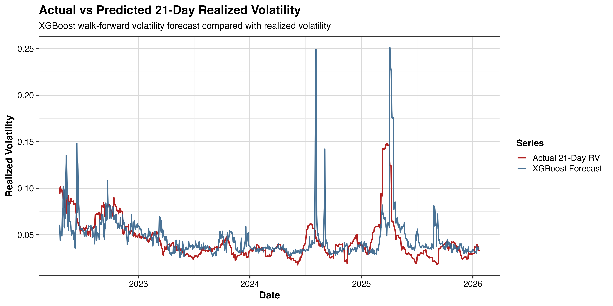
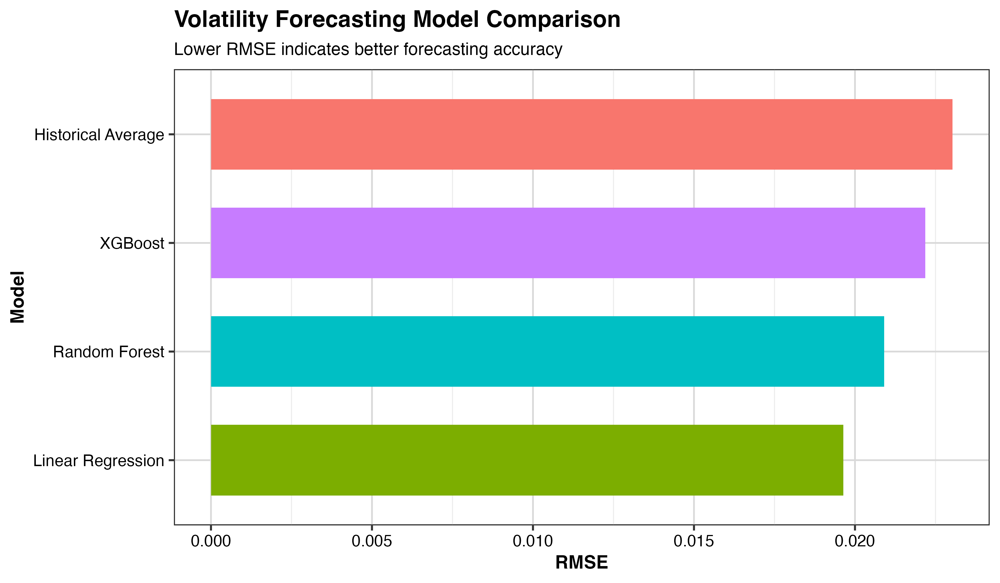
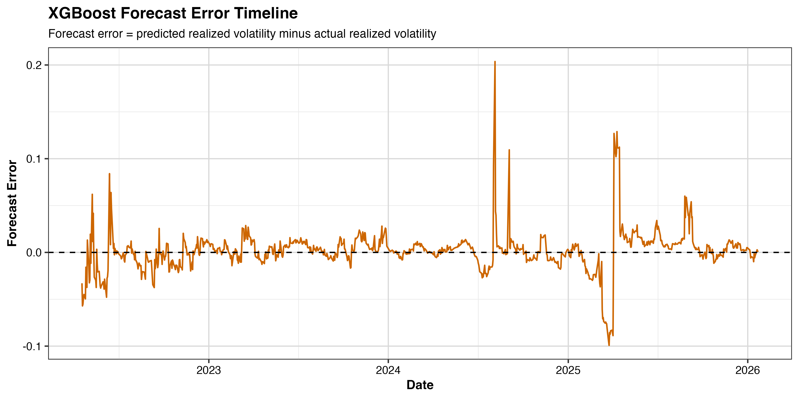
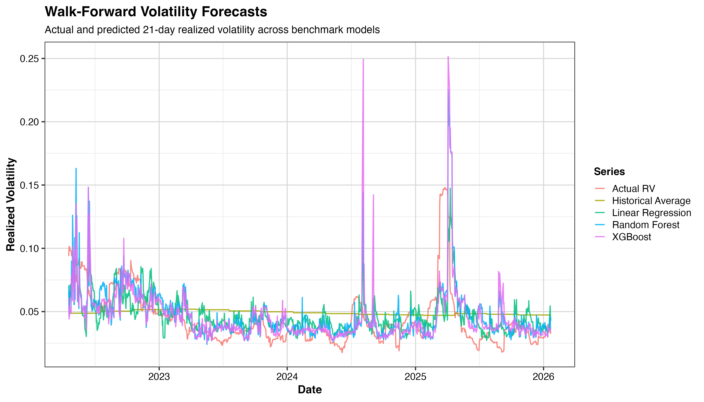
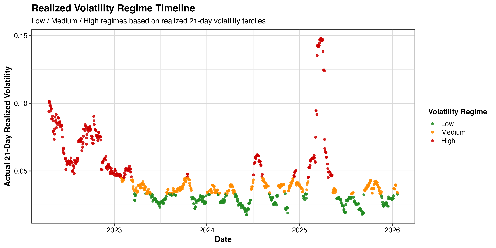

# Leakage-Safe Volatility Forecasting Benchmark

Leakage-safe volatility forecasting benchmark system for financial risk monitoring.

## Short Description

This project implements a leakage-safe volatility forecasting benchmark system for financial risk monitoring. It forecasts future 21-trading-day realized volatility for SPY using ETF market data, volatility features, cross-asset indicators, and walk-forward machine-learning models.

The project is designed as a practical volatility-monitoring and decision-support framework rather than a trading-alpha strategy.

## Project Overview

This repository provides a reproducible pipeline for building a volatility forecasting benchmark system. The system downloads ETF market data, constructs historical volatility and cross-asset features, defines future realized-volatility targets, trains benchmark models under a leakage-safe walk-forward design, evaluates forecasting performance, and generates visualization outputs.

The main goal is to demonstrate how AI and machine-learning methods can be implemented in a realistic financial volatility forecasting framework while avoiding look-ahead bias and data leakage.

## Motivation

Volatility forecasting is central to financial risk management, portfolio monitoring, stress testing, and decision support. Higher expected volatility can indicate elevated uncertainty, changing market conditions, and increased downside-risk exposure.

However, many financial machine-learning pipelines are vulnerable to unrealistic evaluation because of:

- random train/test splits on time-series data
- future information entering feature construction
- test-period information entering scaling or preprocessing
- model selection based on unavailable future data
- overly optimistic backtesting results

This project addresses these concerns by using a leakage-safe walk-forward evaluation design.

## Asset Universe

The system uses SPY as the main U.S. equity-market benchmark and includes cross-asset ETF predictors.

The asset universe includes:

- SPY
- QQQ
- IWM
- TLT
- GLD
- VXX

SPY is used as the target benchmark. QQQ and IWM capture growth-stock and small-cap equity behavior. TLT captures long-term Treasury market behavior. GLD captures gold-market behavior. VXX provides a volatility-linked market stress signal.

## Methodology

The project pipeline has six main steps:

1. Download ETF adjusted price data.
2. Construct historical return, realized-volatility, momentum, moving-average, and cross-asset features.
3. Define future realized-volatility targets over 5-, 10-, and 21-trading-day horizons.
4. Train Historical Average, Linear Regression, Random Forest, and XGBoost models using a walk-forward design.
5. Evaluate forecasting performance using RMSE, MAE, QLIKE, and prediction-realization correlation.
6. Generate volatility forecast figures, model comparison tables, and visualization outputs.

## Leakage-Safe Design

The system follows several leakage-safe principles:

- chronological training and testing
- walk-forward model estimation
- training-only feature scaling
- no random train/test split
- no test-period information used in preprocessing
- future realized volatility used only as the prediction target

This design helps reduce look-ahead bias and makes the evaluation closer to a realistic real-time volatility forecasting setting.

## Models

The current version includes:

- Historical Average
- Linear Regression
- Random Forest
- XGBoost

The Historical Average model serves as a simple benchmark. Linear Regression provides an interpretable statistical baseline. Random Forest captures nonlinear relationships and feature interactions. XGBoost adds a modern gradient-boosting benchmark for comparison.

Future extensions may include:

- Elastic Net
- GARCH or GJR-GARCH volatility benchmarks
- LSTM or attention-based deep learning models
- multiple forecast horizons
- additional robustness checks across market regimes

## Repository Structure

```text
leakage-safe-volatility-forecasting/
|-- README.md
|-- run_pipeline.R
|-- requirements_R.txt
|-- data/
|   |-- raw/
|   `-- processed/
|-- scripts/
|   |-- 01_download_data.R
|   |-- 02_build_features.R
|   |-- 03_define_volatility_targets.R
|   |-- 04_walkforward_models.R
|   |-- 05_evaluate_forecasts.R
|   `-- 06_generate_figures.R
|-- outputs/
|   |-- figures/
|   `-- tables/
|-- report/
|   `-- technical_report.md
```

## How to Run

Install the required R packages:

```r
install.packages(c(
  "quantmod",
  "dplyr",
  "zoo",
  "TTR",
  "randomForest",
  "xgboost",
  "ggplot2",
  "tidyr"
))
```

Run the full pipeline step by step:

```bash
Rscript scripts/01_download_data.R
Rscript scripts/02_build_features.R
Rscript scripts/03_define_volatility_targets.R
Rscript scripts/04_walkforward_models.R
Rscript scripts/05_evaluate_forecasts.R
Rscript scripts/06_generate_figures.R
```

Or run the complete pipeline:

```bash
Rscript run_pipeline.R
```

## Main Outputs

The project generates the following processed data files:

```text
data/raw/etf_adjusted_prices.csv
data/processed/features.csv
data/processed/model_dataset.csv
```

The project also generates forecast and evaluation outputs:

```text
outputs/tables/walkforward_volatility_predictions.csv
outputs/tables/volatility_model_evaluation.csv
```

## Example Figures

### Actual vs XGBoost Predicted Volatility



### Model RMSE Comparison



### XGBoost Forecast Error Timeline



### All Model Volatility Forecasts



### Realized Volatility Regime Timeline



## Evaluation Metrics

The system evaluates volatility forecasting performance using:

- RMSE
- MAE
- QLIKE
- Prediction-realization correlation

These metrics evaluate both forecast accuracy and the relationship between predicted and realized volatility.

## Practical Relevance

This project demonstrates how AI-based volatility forecasting research can be translated into a practical financial risk-monitoring benchmark.

The framework can support:

- volatility monitoring
- market-risk review
- portfolio risk management research
- volatility-targeting research
- financial-risk dashboard development
- AI-assisted financial decision support

The project is designed to emphasize realistic evaluation, leakage-safe forecasting, and practical interpretability rather than trading profit maximization.

## Technical Report

A detailed project explanation is available here:

[Technical Report](report/technical_report.md)

## Limitations

This project is for research and decision-support demonstration only. It does not provide investment advice and does not guarantee accurate prediction of future volatility.

The current version uses ETF market data only and does not include macroeconomic variables, credit spreads, option-implied volatility surfaces, liquidity indicators, earnings information, or intraday data.

The main forecast target is future 21-trading-day realized volatility for SPY. Different horizons, assets, or volatility definitions may produce different results.

## Future Work

Future versions may improve the system by adding:

- additional financial and macroeconomic predictors
- GARCH and GJR-GARCH benchmark models
- Elastic Net and other regularized models
- multiple target assets
- multiple forecast horizons
- volatility-targeting backtest overlays
- interpretability analysis
- interactive dashboard or Shiny app
- broader robustness checks across historical market regimes

## License

This project is released under the MIT License.